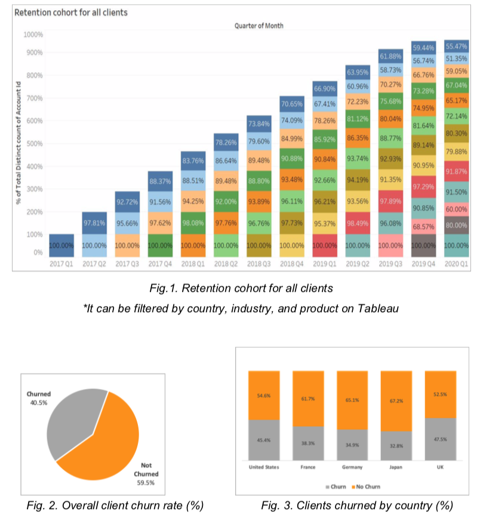
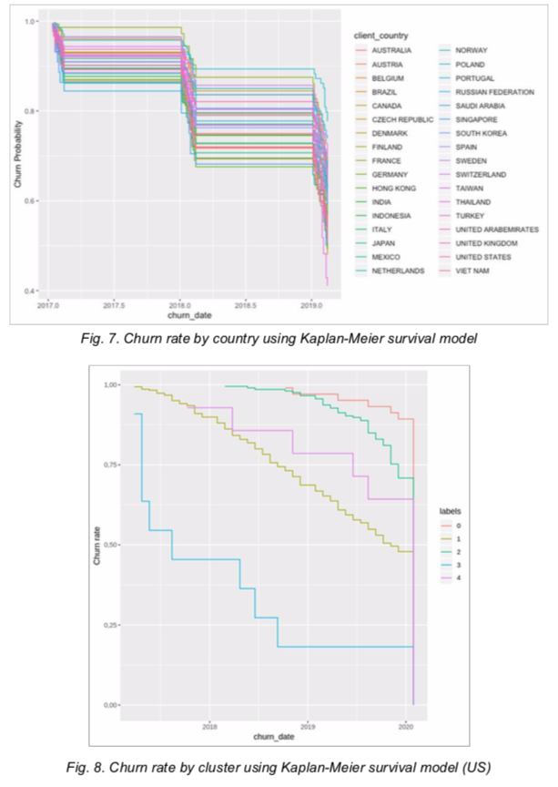

# Datathon with Online Advertisement

### Modelling
There are mainly two unique values to the company. 
1. The models can break down the root cause of the problem by country, industry, and cluster. 
2. The model can further provide the actionable data by automatically identifying the best performing client and the average client
(a client closest to the cluster centroid) within the cluster in terms of tenure, and calculating all
the differences between the two, such as spend by environment, device, criteo product and etc. \
\
This idea is based on a hypothesis that the more similar the clients are, the more related their strategies can be. \
Since the result of clustering is 98% silhouette score, the score which represents the similarity within each cluster, we can conclude that the clients can benchmark the best performing client in terms of tenure and can follow the same strategy. \
We believe that it is a valuable solution for the company, because it can radically reduce the time of analyzing and identifying the problem by the automation, instead of using visualization tools or excel, and quickly adopt the strategies at granular level which are based on decent logic supported by data.
\
### Some Visualization
 \

